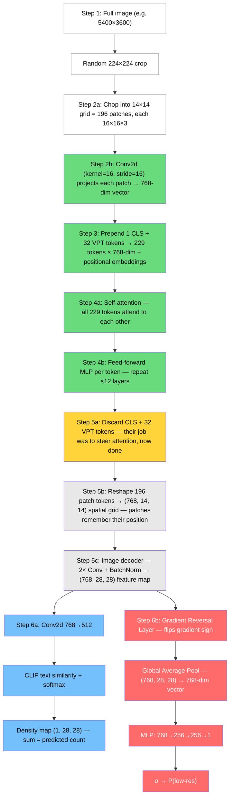

# DANN Poster Presentation Notes

## What to say

### 1. The problem (shared context)
- Crowd counting models trained on HR degrade badly on LR (blurry/distant cameras)
- Real deployment = distant cameras, compressed video, variable zoom
- NWPU baseline: 45 MAE on native, 96 MAE on 4x downscaled — more than 2x worse

### 2. What is DANN?
- Domain-Adversarial Neural Network (Ganin et al., JMLR 2016)
- Originally for domain adaptation (e.g. synthetic→real), we repurpose it for resolution adaptation (HR→LR)
- Goal: force the feature extractor to produce resolution-invariant representations
- Three players: feature extractor (shared CLIP-EBC backbone), counting head, domain classifier
- The trick: Gradient Reversal Layer flips the sign of gradients from the domain classifier back to the encoder
- Effect: encoder learns to count accurately AND to fool the classifier — features become blind to resolution

### 3. Architecture details (for the poster walkthrough)
- Feature extractor: frozen ViT-B/16 + trainable VPT tokens + image decoder
- Domain classifier: hooks onto image_decoder output, GAP → 3-layer MLP (768→256→256→1)
- Alpha scheduling: Ganin schedule ramps from 0→1 over training — let model learn counting first, then gradually force invariance
- Loss: L_total = L_task(HR) + L_task(LR) + dann_weight * L_domain

### 4. Training dynamics — why domain loss going UP is good
- Domain loss starts low (~0.7) = classifier easily distinguishes HR from LR
- As alpha ramps up, GRL pushes encoder to confuse classifier
- Domain loss rises toward ~1.0 = classifier is losing → features ARE becoming resolution-invariant
- This is exactly what DANN is supposed to do — the minimax game is working
- Task loss trends down simultaneously — model still learning to count

### 5. Results — honest negative result
- DANN v1 MAE: native 51.3 (+6.2), 2x down 51.1 (+6.7), 4x down 100.2 (+4.2) — all worse than baseline
- Zoom pairs: mean |HR-LR| diff essentially unchanged (166.0 → 166.2)
- Resolution invariance achieved (domain loss proves it) but did NOT translate to better counting
- This is negative transfer — the adversarial objective hurt task performance

### 6. Why it didn't work — the v1 post-mortem
- Train/eval domain mismatch was the root cause
- V1 generated LR on-the-fly from 224x224 tensor crops using F.interpolate(bilinear)
- Eval used pre-saved downscaled full-resolution images through sliding-window inference
- The discriminator learned to detect bilinear interpolation artifacts on tiny normalized tensors
- The encoder suppressed those artifact signals — signals that are irrelevant at eval time
- It became invariant to the wrong thing

### 7. What we did about it — DANN v2
- Train on the same pre-saved downscaled NWPU images used at eval time
- Both HR and LR go through identical preprocessing pipeline
- Eliminates the train/eval domain gap that caused v1's failure

### 8. What could have been done differently
- Tune dann_weight (we used 1.0 — could try 0.1, 0.01 for softer regularization)
- Different alpha schedules (linear, step, constant low alpha)
- Hook at different feature levels (not just final image_decoder output)
- Multi-scale domain classifiers (separate classifiers at different depths)
- Conditional DANN — separate domain heads for sparse vs dense crowds
- Longer training or learning rate scheduling
- Domain adaptation at pixel level (CycleGAN-style) instead of feature level
- The fundamental question: maybe resolution invariance is the wrong objective — the model might NEED resolution-aware features to handle LR well, just calibrated differently

---

## Full forward pass — step by step

**Color key:** Green = frozen CLIP, Grey = trainable encoder (VPT + decoder), Blue = counting head, Red = DANN branch

---

## Potential questions and answers

### Q: Why use DANN instead of just training on mixed HR+LR data?
- Mixed training is RQ1's approach and does help. DANN asks a deeper question: can we force the internal representation to be explicitly resolution-blind? Mixed training lets the model implicitly handle both, DANN makes it a hard constraint.

### Q: Why is the domain loss going up? Doesn't that mean training is failing?
- No, it means training is SUCCEEDING. The domain classifier is losing the minimax game — the encoder is producing features that look the same for HR and LR. Rising domain loss = increasing confusion = resolution invariance achieved.

### Q: If the training dynamics look healthy, why didn't it improve counting?
- Resolution invariance ≠ resolution robustness. Making features blind to resolution might strip out information the counting head actually needs. The model became invariant to the wrong signal (interpolation artifacts, not resolution-relevant features).

### Q: What's the difference between v1 and v2?
- V1 degraded images on-the-fly from small tensor crops (F.interpolate). V2 uses pre-saved downscaled full-res images — same distribution the model sees at evaluation. V1's discriminator learned the wrong thing.

### Q: How is this different from standard DANN (e.g. for synthetic→real)?
- Standard DANN adapts between two genuinely different domains (rendered vs photo). Here both domains are natural images — the difference is only resolution. This is a much subtler domain gap, which may be why adversarial pressure easily overshoots.

### Q: Couldn't you just tune the dann_weight lower?
- Yes, this is a valid next step. dann_weight=1.0 gives equal importance to domain confusion and counting — a lower weight would apply softer regularization. We didn't have time to sweep this.

### Q: Why not use a different adaptation method?
- Good question. ADDA, MCD, or MMD-based methods could work. We chose DANN for its simplicity and because the GRL makes it a clean single-model approach. But the negative result suggests the paradigm (feature-level domain invariance) might be wrong for resolution, not just the specific method.

### Q: Is this result still useful?
- Yes. Negative results are informative. We showed that (1) DANN mechanically works — features do become invariant, (2) resolution invariance alone doesn't improve counting, (3) the train/eval pipeline mismatch matters enormously. The v1→v2 debugging story is itself a contribution about proper experimental methodology.

### Q: Could the baseline reproducibility gap (45 vs 36 reported) affect your conclusions?
- Our DANN comparison is fair — both baseline and DANN use the same checkpoint and eval pipeline. The gap with the paper's reported numbers is a separate issue that affects absolute numbers, not our relative comparisons.

### Q: What about the zoom pairs?
- 61 real optical HR/LR pairs from the supervisor, no labels. We measure prediction consistency (do HR and LR predict similar counts?). DANN v1 showed no improvement (166.0→166.2 mean absolute difference). This is the real-world validity check.
