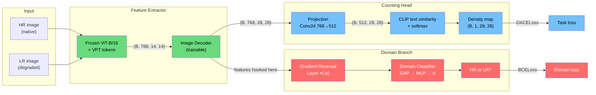

# DANN: Resolution-Adversarial Training

## What's the problem?

Our crowd counting model works well on sharp, high-res images but falls apart on blurry, low-res ones. Somewhere inside the model, the features "know" what resolution the image is — and they behave differently for blurry inputs.

## What does DANN do?

It makes the model's internal features **not care about resolution**. Whether it sees a sharp photo or a blurry one, the features should look the same — containing only information useful for counting people, not information about image quality.

## How? Three players

1. **Feature extractor** (green) — the shared CLIP-EBC backbone. Takes an image and produces internal features.
2. **Label predictor** (blue) — the existing counting head. Takes features and predicts crowd density.
3. **Domain classifier** (red) — a small "detective" network. Takes the same features and tries to guess: "was this high-res or low-res?"

The feature extractor sits at the fork — its features flow to **both** the counting head and the detective. It gets pulled in two directions:
- The counting head says: *"make features useful for counting"*
- The detective (through a flipped gradient) says: *"make features that hide resolution info"*

## The trick: Gradient Reversal Layer

Normally, gradients tell a network "change this way to reduce the loss." The GRL **flips the sign** of gradients flowing from the detective back to the feature extractor. So while the detective learns to distinguish HR from LR, the feature extractor receives the opposite signal — *make them indistinguishable*.

One small layer, inserted between the feature extractor and the detective. That's the whole trick.

## Architecture diagram



## Alpha scheduling

We don't turn on the detective at full strength from day one. The **alpha** parameter ramps from 0 to 1 over training using the Ganin schedule:

```
alpha = 2 / (1 + exp(-10 * p)) - 1     where p = epoch / total_epochs
```

This lets the model first learn useful counting features, then gradually forces them to become resolution-invariant.

## Files

| File | What it does |
|---|---|
| `grl.py` | Gradient reversal layer + alpha schedule |
| `classifier.py` | Domain classifier (GAP + 3-layer MLP) |
| `model.py` | DANNModel wrapper (hooks into CLIP-EBC, adds domain branch) |
| `train.py` | Training loop (HR + LR per batch, combined loss) |

## Usage

```bash
uv run python entrypoints/train_dann.py --epochs 50 --dann_weight 1.0 --down_scales 2 4 8
```

## Reference

Ganin et al., "Domain-Adversarial Training of Neural Networks", JMLR 2016.
